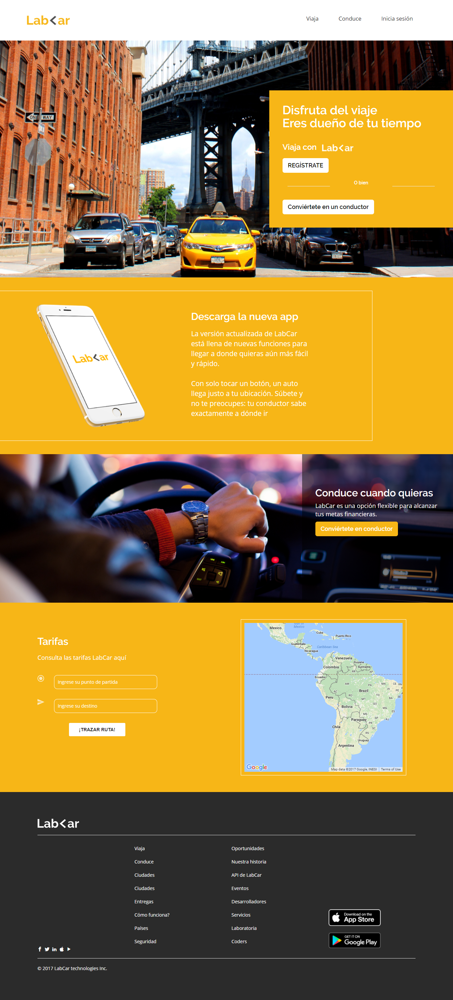

# Reto - LabCar
## OBJETIVO
Recrear la página LabCar usando el  framework `bootstrap` para las versiones: desktop y mobile first. Y también agregar modales.
## Herramientas
* Html5
* Css3
* Js
* Bootstrap

## Resultado
* Versión desktop
***

* Versión mobile
***

***
# Modales
* Modal de Inicia Sesión
***

* Modal de Regístrate
***

* Modal de Convierte en conductor
***

